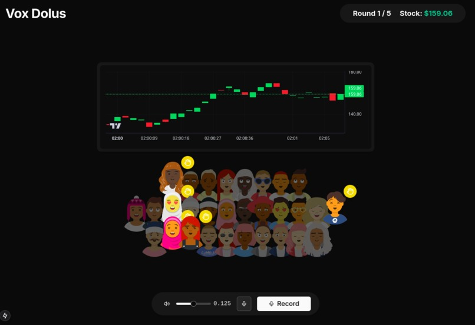

# 🎭 Vox Dolus

> The B.S. Simulator - Can you save your company's stock price from the vicious attacks of the press?

## 🎮 Overview

Vox Dolus is an interactive, real-time simulation where you become a CEO managing a crisis during a high-pressure press conference. Using voice-based interaction with AI, address escalating challenges while managing your company's stock price, public sentiment, and audience reactions. The gameplay is fast-paced, lasting only 1-2 minutes!

## 📸 Screenshot



## ✨ Features

- 🎙️ **Voice Interaction** - Respond to challenges in real-time using your voice
- 📈 **Dynamic Stock Price** - Watch your company's value fluctuate based on your responses
- 🤖 **AI-Driven Audience** - Face diverse questions from AI-powered journalists
- 🔊 **Real-time Reactions** - Experience dynamic audience feedback through cheers, boos, and murmurs
- ⏱️ **Fast-paced Gameplay** - Quick 1-2 minute rounds for intense decision making
- 🎯 **Multiple Rounds** - Choose from 1-8 rounds per game session

## 🛠️ Tech Stack

- ⚛️ React 19
- 🔷 Next.js 15
- 📝 TypeScript
- 🎨 Tailwind CSS
- 🎭 ShadcnUI
- 🔄 Jotai (State Management)
- 🎵 Web Audio API
- 🤖 OpenAI API
- 🗣️ Text-to-Speech
- 📦 PNPM

## 🚀 Getting Started

### Prerequisites

- Node.js 18+
- PNPM
- OpenAI API Key

### Installation

1. Clone the repository:
```bash
git clone https://github.com/yourusername/vox-dolus.git
cd vox-dolus
```

2. Install dependencies:
```bash
pnpm install
```

3. Create a `.env` file:
```env
OPENAI_API_KEY=your_api_key_here
```

4. Start the development server:
```bash
pnpm dev
```

5. Open [http://localhost:3000](http://localhost:3000) in your browser

## 🎯 How to Play

1. 🎮 **Start Game**: Select the number of rounds (1-8)
2. 🎙️ **Listen**: AI journalists will ask challenging questions
3. 🗣️ **Respond**: Hold spacebar to record your response
4. 📈 **Watch**: Monitor your company's stock price in real-time
5. 🔄 **Adapt**: React to audience feedback and adjust your strategy
6. 🏆 **Win**: Keep your stock price up until the end of all rounds!

## 🧪 Game Mechanics

- **Stock Price** 📊
  - Influenced by response quality
  - Features random market volatility
  - Must stay above 0 to continue

- **Audience Reactions** 👥
  - Real-time feedback based on responses
  - Multiple AI personalities
  - Dynamic sound effects and animations

## 👥 Team

- [Oh Tien Cheng](https://github.com/username) - Internal Game Logic & API Integration
- [Faqih](https://github.com/username) - UI/UX & State Management
- [Ong Zheng Kai](https://github.com/username) - Audio Processing & Game Design

## 🏆 Achievements

- 🎉 Hack&Roll 2025 Submission
- 🚀 Successfully implemented real-time AI interactions

## 📝 License

This project is licensed under the MIT License - see the [LICENSE](LICENSE) file for details.

## 🙏 Acknowledgments

- OpenAI for their powerful API
- The Onion for the inspiration
- Hack&Roll 2025 organizers and mentors
